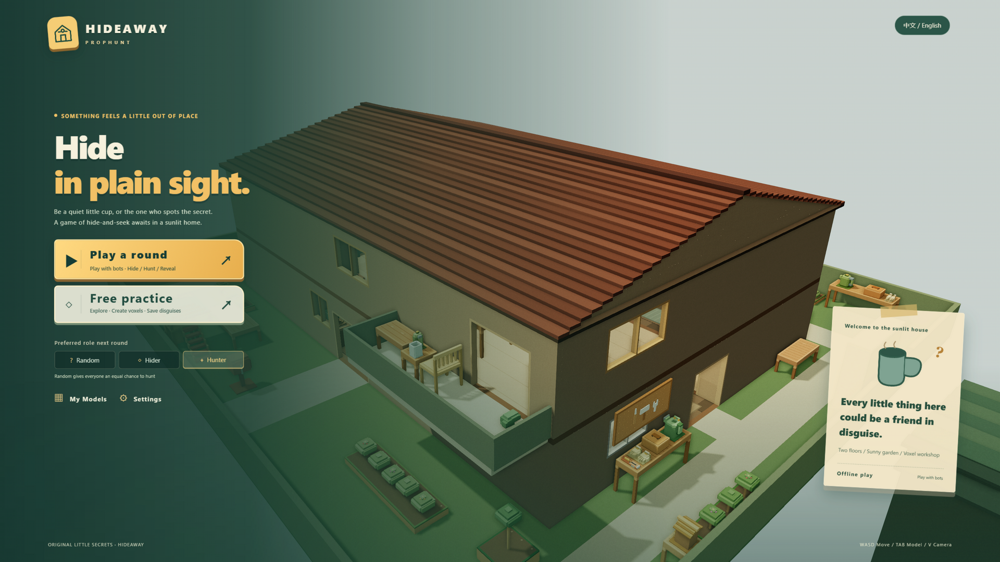
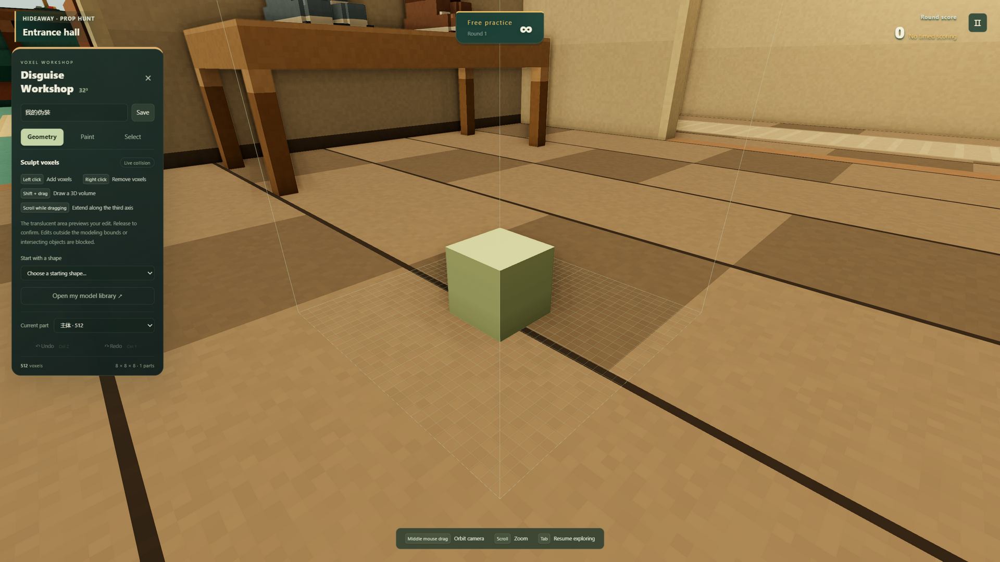
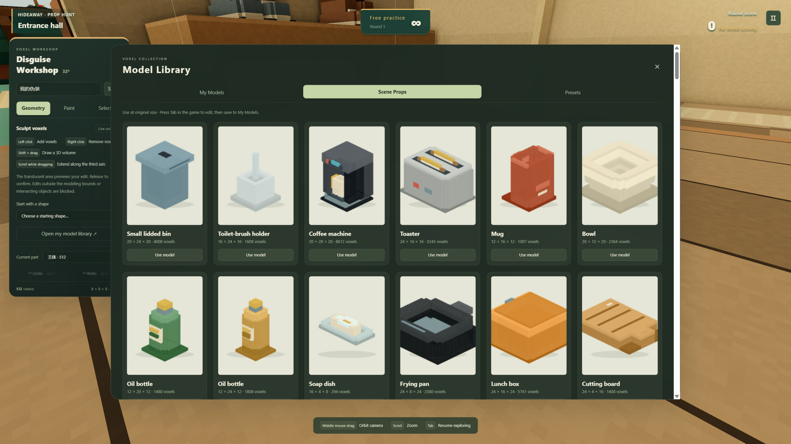
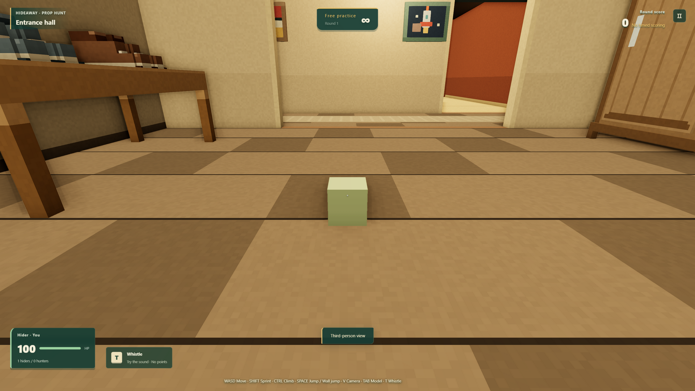
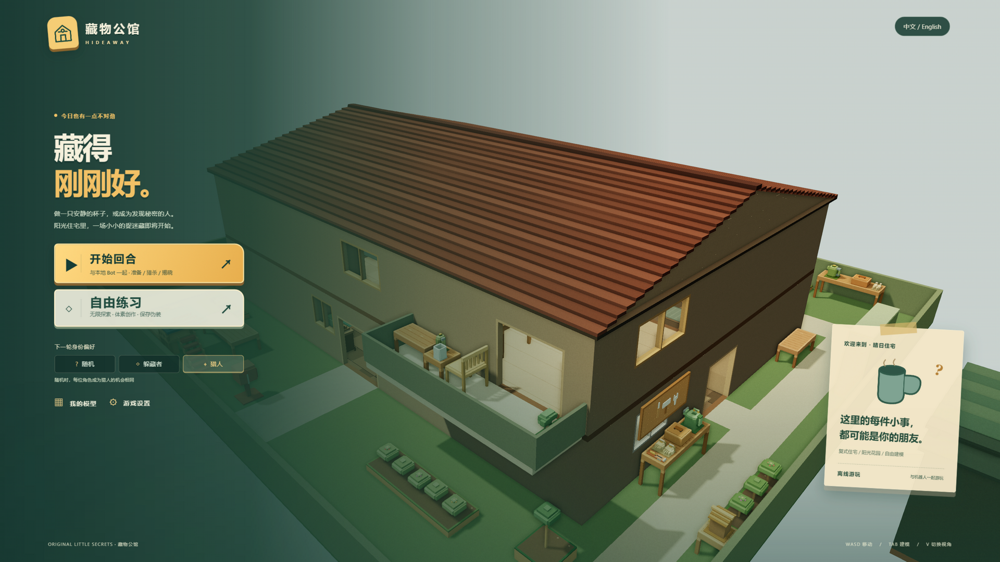

# HIDEAWAY · Voxel Prop Hunt

<div align="center">
  
</div>

[简体中文](README.zh-CN.md) · English

Build a disguise with the voxel editor and play hide-and-seek with local bots in a two-story house and garden. Hiders can reshape their disguise during the chase; hunters use their eyes, sound, and weapons to find them.

**▶ [Play online](https://homie-wu.github.io/hideaway/)** — no install; desktop Chrome / Edge. Models and settings are saved per site in browser storage.

Built with Three.js and Rapier. Play free practice or local rounds with up to eight characters. Online multiplayer is not included.

Switch between English and Chinese in the main menu or pause screen. Your preference is saved in browser storage; the first visit follows your browser language.

## Run locally

Use Node.js 24 or later and desktop Chrome / Edge with hardware acceleration enabled.

```sh
npm ci
npm run dev
```

Open the address printed in the terminal, usually `http://127.0.0.1:5173`. On Windows, you can also double-click `启动游戏.cmd`. Audio starts after your first interaction. Models and settings are saved locally in the same browser and site address.

## Controls

| Action | Key |
| --- | --- |
| Move / sprint / jump | WASD / Shift / Space |
| First-person / third-person view | V |
| Open the voxel editor as a hider | Tab |
| Climb / push off a wall as a hider | Ctrl near a wall; W/S or A/D to move; Space to push off |
| Whistle as a hider | T during the hunt; preview in free practice |
| Crouch / aim as a hunter | Ctrl / right mouse button |
| Attack / reload | Left mouse button / R |
| Switch between knife and gun | 1 / 2, or mouse wheel |
| Take a weapon in the preparation room | Aim at a weapon on the rack and left-click |
| Pause / release the pointer | Esc |

Hunters spend preparation time in a separate room, where they can change weapons and practice at the range. Scoring begins with the hunt. Hitting a scene object costs the hunter health. Each round ends by revealing hiding spots and scores. Settings let you adjust role preference, player count, timers, prop randomization, graphics, and audio.

The editor supports a 32×32×32 grid. Load, edit, and save scene props at their original scale. Model edits update collisions and cannot be used to pass through solid objects.

|  |  |
|---|---|
| The disguise workshop, open mid-game | Scene props, ready to become you |
|  |  |
| You are the green cube. Or are you? | 中文界面 |

## Build and check

```sh
npm test                              # 408 tests passing
npm run build
npm run preview
```

Deploy `dist/` as a static site served over HTTP. The game does not require external model, texture, or audio services.

Optional local browser checks:

```sh
node tools/production-smoke.mjs
node tools/audit-map.mjs
```

Browser checks require local Chrome / Edge. Set `CHROME_PATH` to select an executable. Reports go to the ignored `.artifacts/` directory. See [development notes](docs/development.md) for implementation and asset details.

## GitHub Pages

The repository includes `.github/workflows/pages.yml`. Pushes to `main` run tests and build the site before deploying `dist/`. Pull requests run checks only.

In your GitHub repository, set **Settings → Pages → Build and deployment → Source** to **GitHub Actions**. Push to `main` or manually run **Check and deploy** from the Actions tab. The completed workflow provides the site URL. Keep `node_modules/`, `dist/`, and test screenshots out of commits.

Vite uses relative asset paths so the same build works at a site root or repository subpath. See the [Vite deployment guide](https://vite.dev/guide/static-deploy#github-pages) and [GitHub Pages workflow documentation](https://docs.github.com/en/pages/getting-started-with-github-pages/using-custom-workflows-with-github-pages).

## Project structure

```text
src/                 Game, editor, voxel assets, and world
  world/layout.json  Map layout data
public/models/       Required hunter and weapon assets
assets/characters/   Hunter asset source files
tests/               Behavior and physics regression tests
tools/               Repeatable checks
docs/                Development notes
.github/workflows/   GitHub checks and deployment
```

## License

[MIT](LICENSE). Three.js and Rapier also use the MIT license. This is an independent prop-hunt game prototype and is not affiliated with any reference game.